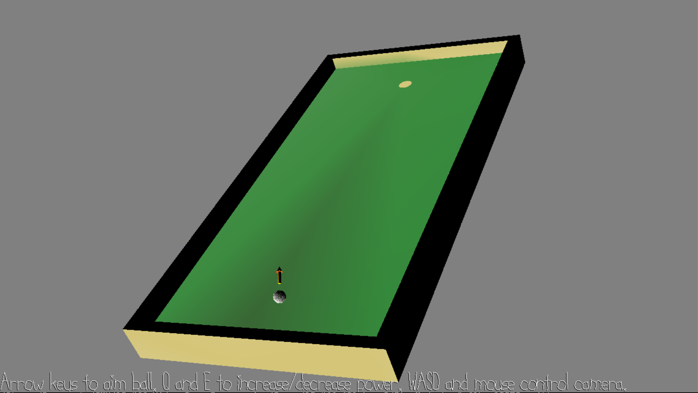

# Golf Alone

Author: Steven Lu (sslu1)

Design: A virtual mini-golf. You can also hit the ball into the air and watch it bounce around.

Screen Shot:

How Your Asset Pipeline Works:

I used blender to create most of the models and the starter scripts to convert them to .pnct and .scene files.

How To Play:

Get the ball in the hole in as few shots as possible. It might be more fun to mess around with the ball physics though.
WASD and the mouse control the camera. The arrow keys aim the ball, and Q/E increase and decrease the shot power.
The golf ball is animated to roll, although I think it only shows up if you are zoomed in enough.

Sources:

 - Golf Ball: https://www.turbosquid.com/3d-models/free-3ds-mode-golf-ball/1018024
 - Line Font by Jim McCann

This game was built with [NEST](NEST.md).

